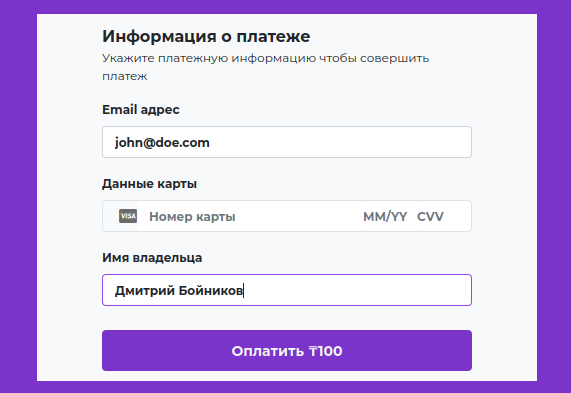

# FundMatch
> The project was implemented as a result of participation
> in the "SportTech vs PropTech Hackathon" in Karaganda

#### Fundraising and accounting application for the organizing sports team games.
##### Contents:
- [Project Presentation](#presentation)
- [Backend (my contribution in the project)](#backend)

# Presentation
### Main interface

### Registration & Login
| Login                           | Code Confirm                          |
|---------------------------------|---------------------------------------|
|  |  |

### Create team and invite members

### Create events

### Pay for the event and Keep track of team funds

| Create payment                    | Payment verification               |
|-----------------------------------|------------------------------------|
|  |  |

# Backend
### Архитектура

    

### Openapi
Formal description of the OpenAPI 3.0 interface here [openapi.json](./openapi.json)

